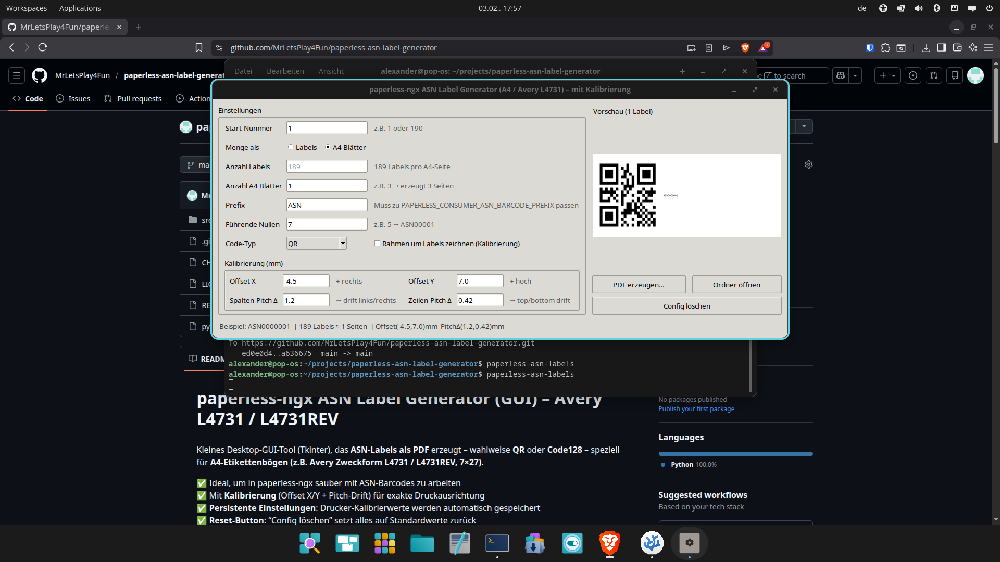

# paperless-ngx ASN Label Generator (GUI + CLI)

Kleines Tool (Tkinter + CLI), das **ASN-Labels als PDF** erzeugt – wahlweise **QR** oder **Code128** – für mehrere **A4-Etikettenlayouts**.

✅ Ideal, um in paperless-ngx sauber mit ASN-Barcodes zu arbeiten  
✅ Mit **Kalibrierung** (Offset X/Y + Pitch-Drift) für exakte Druckausrichtung  
✅ **Persistente Einstellungen**: Drucker-Kalibrierwerte werden automatisch gespeichert  
✅ **Mehrere Layouts** (z. B. `L4731`, `L7160`)  
✅ **Drucker-Profile** speichern/laden (ohne JSON-Edit)  
✅ **CLI-Modus** für Automatisierung  
✅ **Reset-Button**: “Config löschen” setzt alles auf Standardwerte zurück

> Hinweis: Inoffizielles Tool, nicht affiliated mit paperless-ngx.

<p align="center">
  
</p>

---

## Voraussetzungen

- **Python 3.10+**
- Optional: **Git** (nur wenn Installation direkt von GitHub erfolgt)
- **Linux**: `python3-tk` (Tkinter GUI Paket)

---

## Installation & Start

> **Wichtig (Linux):** Viele Distributionen blockieren systemweite `pip3 install ...` Installationen (PEP 668).  
> Nutze dort am besten **pipx** oder eine **virtuelle Umgebung**.

### Windows

#### Empfohlen: pipx (sauber, isoliert)
1) Python installieren (bei python.org) und **„Add Python to PATH“** aktivieren.  
2) pipx installieren:
```bash
python -m pip install --upgrade pip
python -m pip install pipx
python -m pipx ensurepath
```
Terminal neu öffnen.

3) Installieren & starten:
```bash
pipx install git+https://github.com/MrLetsPlay4Fun/paperless-asn-label-generator.git
paperless-asn-labels
```

#### Alternative: Virtualenv
```bash
python -m venv .venv
.venv\Scripts\activate
pip install git+https://github.com/MrLetsPlay4Fun/paperless-asn-label-generator.git
paperless-asn-labels
```

---

### macOS

#### Empfohlen: pipx
1) (Optional) Python via Homebrew:
```bash
brew install python
```

2) pipx installieren:
```bash
python3 -m pip install --upgrade pip
python3 -m pip install pipx
python3 -m pipx ensurepath
```
Terminal neu öffnen.

3) Installieren & starten:
```bash
pipx install git+https://github.com/MrLetsPlay4Fun/paperless-asn-label-generator.git
paperless-asn-labels
```

---

### Linux (Debian/Ubuntu/Pop!_OS)

#### 1) Tkinter installieren (GUI)
```bash
sudo apt update
sudo apt install -y python3-tk
```

#### 2) Empfohlen: pipx installieren
```bash
sudo apt install -y pipx
pipx ensurepath
```
Terminal neu öffnen.

#### 3) Installieren & starten (GitHub)
```bash
pipx install git+https://github.com/MrLetsPlay4Fun/paperless-asn-label-generator.git
paperless-asn-labels
```

#### Alternative: Virtuelle Umgebung (wenn du pipx nicht willst)
```bash
python3 -m venv ~/.venvs/paperless-asn
source ~/.venvs/paperless-asn/bin/activate
pip install --upgrade pip
pip install git+https://github.com/MrLetsPlay4Fun/paperless-asn-label-generator.git
paperless-asn-labels
```

---

## Update

### Wenn mit pipx installiert
```bash
pipx upgrade paperless-asn-labels
```

Falls das Paket unter pipx anders heißt:
```bash
pipx upgrade-all
```

### Wenn in einer venv installiert
```bash
pip install -U --force-reinstall git+https://github.com/MrLetsPlay4Fun/paperless-asn-label-generator.git
```

---

## Nutzung

- Start-Nummer wählen (z.B. 1 oder 190)
- Layout wählen (z. B. `L4731` oder `L7160`)
- Prefix setzen (muss zu paperless-ngx passen)
- Führende Nullen einstellen (z.B. 7 → `ASN0000001`)
- Menge als **Labels** oder **A4-Blätter**
- Optional: **Startposition auf Bogen** setzen (bei angebrochenem Blatt)
- Code-Typ: **QR** oder **CODE128**
- Optional: **Nach PDF öffnen** (`none`, `file`, `folder`)
- Optional: **Rahmen aktivieren** (hilft beim Kalibrieren)
- Optional: Profil speichern/laden/löschen (z. B. je Drucker)
- „PDF erzeugen…“ → Datei speichern

---

## Profile (Drucker-Profile)

Profile speichern deine aktuellen Einstellungen als Set (Layout, Kalibrierung, Startposition, Code-Typ usw.).

- Standardprofil: **`Brother MFC-L2710DW`**
- Buttons in der GUI:
- **Profil speichern**: aktuelle Einstellungen unter neuem Namen speichern
- **Profil laden**: gewähltes Profil aktivieren
- **Profil löschen**: Profil entfernen (Standardprofil ist geschützt)
- **Profile exportieren**: alle gespeicherten Profile als JSON-Datei exportieren

---

## CLI-Modus (Automatisierung)

Du kannst PDFs ohne GUI erzeugen:

```bash
paperless-asn-labels --cli --output /tmp/asn.pdf --layout L4731 --count 30 --prefix ASN --zeros 7 --kind QR
```

Seitenmodus (exakte Blattanzahl):

```bash
paperless-asn-labels --cli --output /tmp/asn_pages.pdf --layout L7160 --pages 2 --start-position 5 --kind CODE128
```

Alle Optionen:

```bash
paperless-asn-labels --help
```

Hinweis: Wenn CLI-Optionen gesetzt sind (z. B. `--output`, `--count`, `--pages`), läuft das Tool automatisch im CLI-Modus.

---

## Gespeicherte Einstellungen (Config)

Deine Kalibrierwerte & UI-Einstellungen werden automatisch gespeichert (persistente Config).  
Der Speicherort ist:

- **Linux:** `~/.config/paperless-ngx-asn-labels/config.json` (oder `$XDG_CONFIG_HOME/...`)
- **macOS:** `~/Library/Application Support/paperless-ngx-asn-labels/config.json`
- **Windows:** `%APPDATA%\paperless-ngx-asn-labels\config.json`

Im Programm gibt es außerdem den Button **„Config löschen“**, der die Datei entfernt und auf Standardwerte zurücksetzt.

---

## Prefix in paperless-ngx

Der Prefix muss zu deiner paperless-ngx Einstellung passen:

- `PAPERLESS_CONSUMER_ASN_BARCODE_PREFIX`

Beispiel: Wenn du in paperless-ngx `ASN` nutzt, dann hier auch `ASN`.

---

## Druck-Hinweis (sehr wichtig)

Bitte im PDF-Viewer/Printer **100%** drucken:
- **kein** „An Seite anpassen“
- **kein** „Skalieren“
- **kein** „Fit to Page“

Wenn die Position nicht exakt passt:
- Rahmen aktivieren
- Offset X/Y und Pitch-Δ anpassen

---

## Entwicklung (Repo klonen & lokal starten)

```bash
git clone https://github.com/MrLetsPlay4Fun/paperless-asn-label-generator.git
cd paperless-asn-label-generator

python3 -m venv .venv
source .venv/bin/activate

pip install -e .
paperless-asn-labels
```

---

## Lizenz
GNU AGPLv3 (siehe LICENSE)
